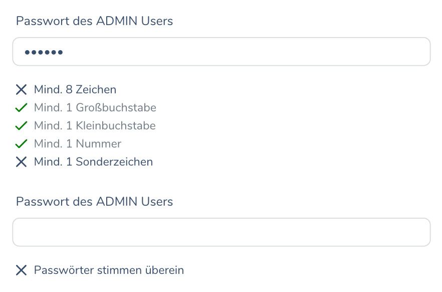

### Example integration:

    <PasswordFieldsWithConfirmation
    v-model:password="form.password"
    v-model:password_confirmation="form.password_confirmation"
    password_label="Passwort des ADMIN Users"
    password_confirmation_label="Passwort wiederholen"
    @password_validation="(is_valid) => (password_valid = is_valid)"
    />
    
    ...
    <!-- A button that is only enabled when password matches requirements -->
    <button
        @click="submit"
        class="btn btn-sm btn-success"
        :disabled="!password_valid"
    >
        Anlegen
    </button>

    ...

    

### Result
